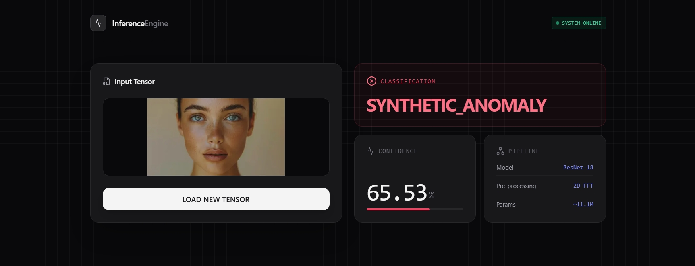
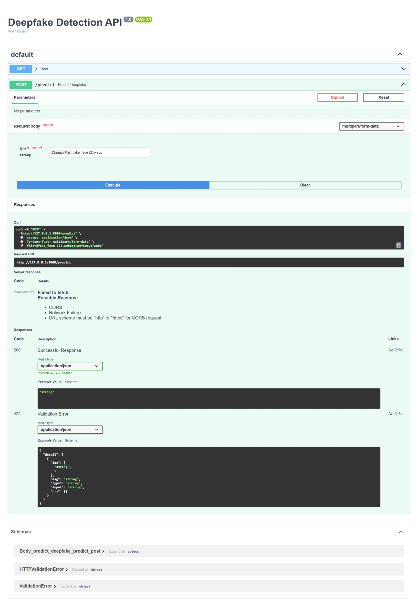

# 🔍 InferenceEngine: Frequency-Based Deepfake Detection

[](https://deepfake-detection-engine.vercel.app/)
[](#)
[](#)
[](#)

A full-stack, cloud-deployed machine learning application that detects synthetic anomalies and deepfakes. Rather than relying solely on spatial pixel data, this engine transforms media into the **frequency domain** to uncover microscopic digital artifacts left behind by GANs and modern Diffusion models.

---

## 📸 Interface & API Preview

<div align="center">
  
  <br><br>
  <i>Auto-generated Swagger UI for backend API testing</i><br>
  
</div>

---

## 🧠 The Architecture: Why Frequency Matters

Standard convolutional neural networks (CNNs) often struggle against modern high-fidelity diffusion models (like Midjourney or Flux) when looking only at spatial pixels. To solve this, this pipeline utilizes a **2D Fast Fourier Transform (FFT)** preprocessing step.

**The Pipeline:**
1. **Micro-Blurring (3x3 Kernel):** A delicate Gaussian blur filters out standard camera sensor noise and Moire patterns without erasing the high-frequency synthetic artifacts.
2. **Frequency Domain Transformation:** The image is converted to grayscale and passed through a 2D FFT to generate a magnitude spectrum.
3. **Anomaly Classification:** The resulting frequency map is fed into a custom-tuned **ResNet-18** architecture. Because AI generators leave periodic, grid-like spectral fingerprints in the frequency domain, the ResNet easily identifies synthetic media that looks flawless to the human eye.

---

## ⚙️ Tech Stack & Infrastructure

**Backend (Inference Engine) - Hosted on Hugging Face Spaces (Docker)**
* **PyTorch & Torchvision:** Custom ResNet-18 model loading and tensor operations.
* **OpenCV (cv2) & NumPy:** Image processing, matrix manipulation, and FFT math.
* **FastAPI & Uvicorn:** High-performance, asynchronous REST API. Provides auto-generated OpenAPI (Swagger) documentation.

**Frontend (Client UI) - Hosted on Vercel**
* **React & Vite:** Fast, responsive user interface.
* **Tailwind CSS:** Modern, forensic-style dark mode UI with interactive Bento-grid results.
* **Axios:** Handles multipart/form-data tensor transmission to the cloud backend.

---

## 🚀 Live Demo

Try the live engine here: **[deepfake-detection-engine.vercel.app](https://deepfake-detection-engine.vercel.app/)**

*Note: The backend inference engine is hosted on a free Hugging Face Docker Space. If it hasn't been used in 48 hours, it may take 1-2 minutes to "wake up" on your first scan.*

---

## 💻 Local Installation & API Testing

If you wish to run the engine locally for development:

### 1. Clone the Repository
```bash
git clone [https://github.com/anushkadas/deepfake-detection-engine.git](https://github.com/anushkadas/deepfake-detection-engine.git)
cd deepfake-detection-engine